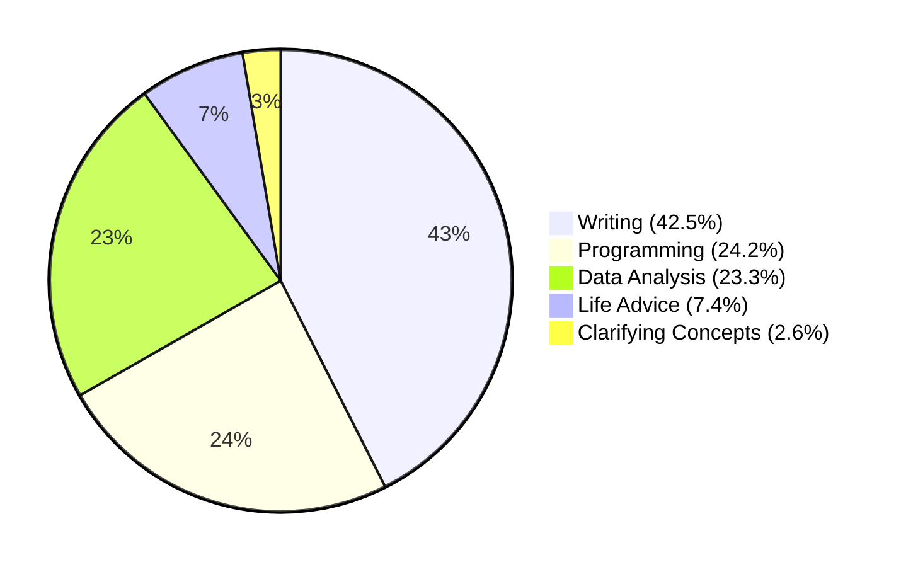
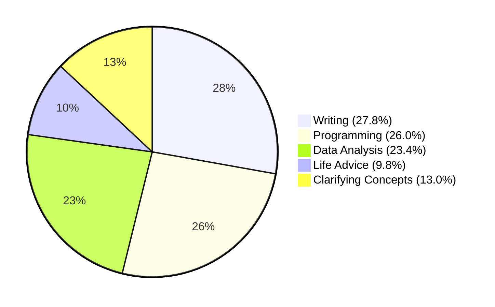
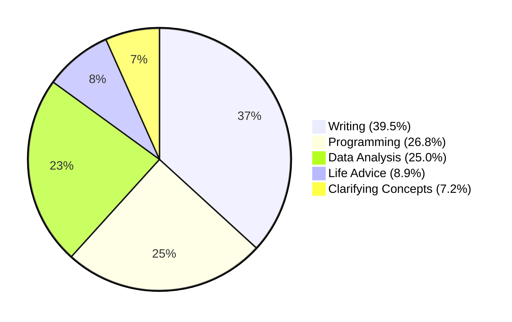

# How I Use Claude

I've been a heavy user of Claude for the past few months and anecdotally, ever since Sonnet 3.6, I've been using it more and more.

I was kind of curious to see how I use it on a day to day basis and so when I realised I could export my claude chat history, I thought I'd try to do some analysis on it.

I'll write a separate post on how I did the analysis but I thought I'd share some of the results here. [Here is a guide on how to export your Claude chat history](https://support.anthropic.com/en/articles/9450526-how-can-i-export-my-claude-ai-data).

I was inspired by this [post by Boretti Fernando](https://borretti.me/article/how-i-use-claude) and thought I'd try to do something similar.

## Analysis

I used `gemini-flash` to and `text-embedding-3-small` to generate descriptions of my conversations which I then embedded and clustered. These clusters were then recursively combined with new higher level clusters being generated until I had ~10 unique clusters.

This was based off Anthropic's recent paper on [Clio](https://www.anthropic.com/research/clio) which is their internal tool that uses clustering to group conversations into different categories which I'll write a bit more about in a separate post.

It's a bit difficult to make sense of all the output so i did the next best thing and fed the entire tree into Claude to get it to summarise the clusters for me.

```bash
Clusters
├── Improve text, code, and generate diverse content
│ Description: Users requested assistance with improving text and code, and generating
│ diverse content and marketing materials. Tasks included rewriting, debugging, analysis,
│ and content creation across various domains.
│ Contains 308 conversations
│ ├── Rewrite and improve text and code
│ │ Description: Users requested assistance with improving and rewriting various types
│ │ of text, including articles, marketing materials, technical documents, and code.
│ │ Tasks ranged from enhancing clarity and conciseness to debugging code and
│ │ analyzing data.
│ │ Contains 183 conversations
│ │ ├── Rewrite articles and marketing copy related to AI and databases
│ │ │ Description: Users requested assistance rewriting articles and marketing
│ │ │ materials about AI, databases, and related technologies. The requests involved
│ │ │ tasks such as improving clarity, style, conciseness, and creating outlines
│ │ │ and summaries.
│ │ │ Contains 28 conversations
... more clusters
```

Rather than try to provide the entire cluster here, I'll provide a summary of the high level categories that these clusters would fall into below - showing pre-sonnet 3.6, post-sonnet 3.6 and then a combined view.

**Pre-Sonnet 3.6 Usage Distribution (n=529)**



**Post-Sonnet 3.6 Usage Distribution (n=338)**



**Combined Usage Distribution (n=867)**



Here are some of the general trends we can see

1. The overall share of programming remains relatively constant from 24.2% to 26.8%
2. Writing and content creation has dropped in terms of its overall share from 42.5% to 27.8%
3. We can see that I started to use Claude less for Data analysis ( which tracks because I started using Cursor and Python more for this )
4. The biggest change has been more towards Clarifying Concepts - which grew from 2.6% to 13%

This tracks anecdotally with my experience using Claude. While I've been using it consistently for writing - it tends to be 1-2 conversations per article, Claude tends to nail it quite quickly. I've been asking it more and more questions about concepts and general life questions - like how often to apply sunscreen.

> I wrote about creating LLM workflows [here](./what-i-learnt-about-language-models.md) and give examples such as how I set up my Claude projects for writing and content creation.

## Raw Stats

> I took [this article here](https://www.anthropic.com/news/3-5-models-and-computer-use) as the launch date for Claude 3.6 Sonnet.

Looking at my chat history, I've sent around 250,000 words to Claude over the past year - which is roughly equal to the entire **Lord Of The Rings** trilogy according to Claude.

I'd say though that personally, the model was deployed slightly later, as seen by the sudden uptick in usage somewhere around mid November instead.


Initially, I was having about 80 chats per week, though that's dropped a good amount lately. I do attribute this to the fact that I've been using Cursor more for programming tasks.


What's an interesting trend is that post-claude 3.6 sonnet, I've been having longer chats - we can see that there's an increasing trend here in the number of messages per chat.


The increase with asking more personal and conceptual questions reflects a broader trend in my usage - a growing trust in Claude's ability to engage meaningfully across a wide range of topics. The ability to have these more casual conversations, alongside serious technical discussions, has made Claude feel like a more complete thinking partner.

But overall I'd say that if we combined it with my cursor usage, the composition for Programming and Development would be significantly higher since I use claude 3.6 for my day to day programming tasks - especally for smaller refactors.

## Why you should try Claude

I think Claude is amazing.

It has the best instruction adherence I've found and it just kind of gets the multiturn conversations right, a lot more than what I've found from other models, even ones like O1 sometimes.

It also comes with the added benefit of having a writing style that is slightly less recognisable than ChatGPT and it adapts much better to your personal writing style. What starts as a tool for specific tasks might become something quite different - and often more valuable - over time. The best approach is to experiment, stay open to new possibilities, and let your usage patterns emerge naturally based on where you find the most value.

Looking ahead, I'm curious to see how my usage continues to evolve. If the past year is any indication, the ways we interact with AI assistants will likely keep shifting as the technology improves and we discover new ways to integrate these tools into our work and thinking processes.
