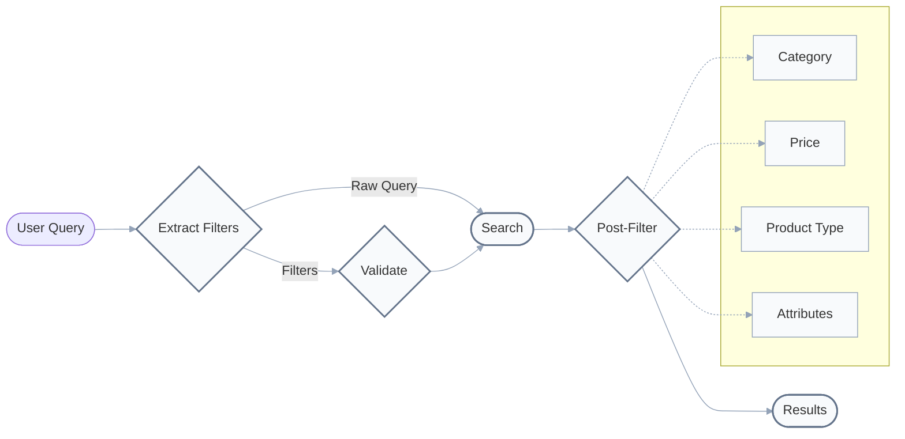

People always talk about looking at your data but what does it actually mean in practice?

In this post, I'll walk you through a short example. After examining failure patterns, we discovered our query understanding was aggressively filtering out relevant items. We improved the recall of a filtering system that I was working on from 0.86 to 1 by working on prompting the model to be more flexible with its filters.

There really are two things that make debugging these issues much easier

1. A clear objective metric to optimise for - in this case, I was looking at recall ( whether or not the relevant item was present in the top `k` results )
2. A easy way to look at the data - I like using `braintrust` but you can use whatever you want.

Ultimately debugging these systems is all about asking intelligent questions and systematically hunting for failure modes. By the end of the post, you'll have a better idea of how to think about data debugging as an iterative process.

## Background

In this specific case, our filtering system takes in a user query and returns a list of products that match the user's query. We can think of it as follows.



We can represent these filters using a Pydantic schema as seen below where we have category/subcategory specific attributes Eg. sleeve length, fit etc

```python
class Attribute(BaseModel):
    name: str
    values: list[str]


class QueryFilters(BaseModel):
    attributes: list[Attribute]
    material: Optional[list[str]]
    min_price: Optional[float] = None
    max_price: Optional[float] = None
    subcategory: str
    category: str
    product_type: list[str]
    occasions: list[str]
```

The goal of the system is to return a list of products that match the user's query. The system is evaluated using the following metrics:

- Recall@k - whether or not the relevant item was present in the top `k` results
- MRR@k - the mean reciprocal rank of the relevant item in the top `k` results

Here's a simplified hierachy of what our catalog looks like - in actuality we have a much more complex hierarchy with many more categories and subcategories.

```
Category: Women
└── Subcategory: Bottoms
    └── Product Types:
        - Jeans
        - Pants
        - Shorts
└── Subcategory: Tops
    └── Product Types:
        - Blouses
        - T-Shirts
        - Tank Tops
```

## Initial Implementation: Finding Failure Patterns

Our initial metrics looked promising but had clear room for improvement:

| Metric    | Filtered Results | Semantic Search |
| --------- | ---------------- | --------------- |
| recall@3  | 79.00%           | 60.53%          |
| recall@5  | 79.00%           | 71.05%          |
| recall@10 | 86.00%           | 84.21%          |
| recall@15 | 86.00%           | 86.84%          |
| recall@25 | 86.00%           | 94.74%          |

If we were to look at the raw numbers, we might be tempted to think that structured extraction is the problem - in other words, perhaps we shouldn't apply the filters at all.

But that's the wrong way to think about it. We need to understand _why_ we were failing and ultimately using structured metadata filters ensures we serve up reliable and accurate results that conform to what users want.

So I started looking at specific examples where the relevant item failed to appear in the top `k` results.

```python
Query: "Looking for comfortable, high-rise pants... prefer durable denim..."

Actual Item:
- Category: Women
- Subcategory: Bottoms
- Product Type: Jeans
- Title: "High-Waist Blue Jeans"

Generated Filters:
category: Women
subcategory: Bottoms
product_type: [Pants]  # Would you make this mistake as a human?
```

This failure is interesting because a human would never make this mistake. When someone asks for "pants in denim," they're obviously open to jeans. This insight led to our first iteration.

## First Iteration: Think Like a Human

We broadened category matching to mirror human thinking and added to our structured extraction prompt additional rules as seen below. These would make the filters more relaxed and help to catch cases where the user might be a bit too vague.

- When users mention "pants", include both pants and jeans
- When users ask for "tops", include both blouses and tank tops

Here's how it looked in practice:

```python
Query: "Looking for a comfy cotton top for summer..."

Actual Item:
- Category: Women
- Subcategory: Tops
- Product Type: Blouses
- Title: "Sleeveless Eyelet Blouse"

Previous Filters: [Tank Tops]  # Too literal
Updated Filters: [Tank Tops, Blouses]  # More human-like reasoning
```

This change improved our metrics:

| Metric    | Updated Results | Previous Results |
| --------- | --------------- | ---------------- |
| recall@3  | 81.58%          | 79.00%           |
| recall@5  | 81.58%          | 79.00%           |
| recall@10 | 89.47%          | 86.00%           |
| recall@15 | 89.47%          | 86.00%           |
| recall@25 | 89.47%          | 86.00%           |

We've managed to increase recall by 3% - not a huge improvement but it's a start. So we looked a few of the other failing examples to see if we could improve recall further.

## Trigger-Happy Model Filters

Our next set of failures revealed an interesting pattern:

```python
Query: "Looking for women's bottoms... in denim"

Actual Item:
- Category: Women
- Subcategory: Bottoms
- Product Type: Shorts
- Title: "Classic Denim Shorts"

Generated Filters:
product_type: [Jeans]  # Why assume a specific type?
```

This led to a new insight - our model was choosing a specific product type at each step even though users didn't specify it at all. While the resonse model itself allows for multiple product types ( or an empty list to indicate that everything is acceptable ), the structured extraction model was being too strict.

Therefore, we added the following rule to the structured extraction prompt so that it would be more flexible with its filters.

```
Only choose a product type if the user explicitly mentions it -
otherwise, stay at the category level
```

The results were dramatic:

| Metric    | Final Results | Initial Results |
| --------- | ------------- | --------------- |
| recall@3  | 92.11%        | 79.00%          |
| recall@5  | 92.11%        | 79.00%          |
| recall@10 | 100.00%       | 86.00%          |
| recall@15 | 100.00%       | 86.00%          |
| recall@25 | 100.00%       | 86.00%          |

## Conclusion

When looking at your data, it's important to realise that the goal is not to chase a perfect 100% score. Language Models are inherently probablistic systems and we should be looking to understand where they tend to trip up.

By looking for specific patterns in our evaluation data, we can systematically improve our system and work towards a more robust application. Each iteration should look at specific failure modes and test a hypothesis about why the system is failing.

By slowly but surely tackling these issues, we can add guardrails or safeguards to our system so that it becomes more reliable and robust over time.
